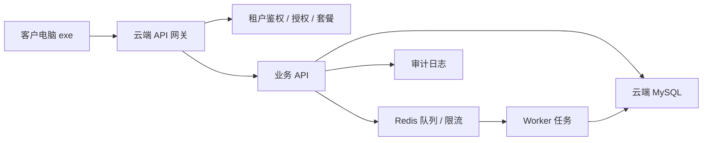

# 云端多租户迁移说明

更新时间：2026-05-24

## 迁移结论

当前产品后续按“本地 exe 客户端 + 云端 API + 云端 MySQL + 多租户授权计费”迁移。

客户电脑只安装 exe，不要求客户自己安装 MySQL。客户数据统一进入我们托管的云端 MySQL，由云端 API 做登录、授权、套餐、租户隔离、限流和审计。exe 负责打开本地界面、可视化授权浏览器、本机登录态加密和人工确认操作。

## 为什么要多租户

多租户就是一套系统服务多个客户，每个客户是一个租户：

- 租户 A 看不到租户 B 的线索、账号、任务、审计。
- 每个租户可以有自己的员工账号、回复账号池、套餐、到期时间和每日额度。
- 我们可以统一维护代码、统一升级版本、统一做收费和停用。
- 高并发时可以按租户拆队列、限流、统计成本和排查问题。

这和另一个项目的多租户模式是同一个方向，只是本项目多了本地 exe、可视化授权浏览器和人工确认回复的桌面能力。

## 目标架构

## 数据归属

所有核心业务表必须带 `tenantId`：

- users：租户下的员工账号。
- reply_accounts：租户下的私人号资产池。
- leads：租户下的线索池。
- source_samples：租户下的评论样本。
- discovery_rules：租户下的发现规则。
- discovery_candidates：租户下的候选线索。
- collection_tasks：租户下的采集任务。
- account_monitors：租户下关注账号监控。
- task_runs：租户下任务运行记录。
- audit_logs：租户下审计日志。

平台管理员账号可以跨租户查看和处理；普通客户管理员、运营、销售只能访问自己租户。

## 授权和收费

长期建议把授权拆成两层：

1. exe 激活
   - 防止安装包随意传播。
   - 记录设备、版本、最近校验时间。
   - 支持离线宽限，避免客户网络不稳定。

2. 租户套餐
   - 控制到期时间、员工数量、回复账号数量、每日线索量、AI 调用额度。
   - 续费后云端生效，exe 下次联网自动同步。
   - 欠费或停用后保留查看历史，限制新增、导入、运行和导出。

## 高并发策略

- API 无状态，可横向扩容。
- MySQL 存业务数据，Redis 存队列、短锁、限流和热点缓存。
- 评论导入、AI 识别、去重合并、通知、账号检测进入队列执行。
- 账号动作按 `tenantId + accountId` 限流，同一账号串行处理。
- 审计日志 append-only，关键动作没有审计记录就视为失败。
- 所有导入和线索生成都要有幂等键，避免重复提交造成重复线索。

## 本轮已迁移的代码底座

本轮先在当前本地 JSON 版本里落了多租户字段和隔离逻辑，方便后面平滑替换 MySQL：

- 新增默认租户 `tenant_demo_001`。
- 用户增加 `tenantId`、`tenantName`、`isPlatformAdmin`。
- 线索、任务、回复账号、评论样本、候选线索、审计日志等核心记录自动补齐 `tenantId`。
- `/api/state`、线索导出、租户内用户列表按当前用户租户过滤。
- 新增/更新/运行/导入/回复等核心接口开始检查记录归属。
- 线索去重和候选生成按租户隔离，避免不同客户同内容互相合并。

## 后续迁移顺序

1. 抽象数据访问层
   - 把 `readDb/writeDb` 后面的业务代码逐步改为 repository。
   - 保留本地 JSON 作为开发和演示模式。

2. 建 MySQL Schema
   - 按当前字段生成 `tenants`、`users`、`leads`、`reply_accounts` 等表。
   - 所有表加 `tenant_id` 索引。
   - 核心写入加事务。

3. 增加云端 API 配置
   - exe 支持配置云端 API 地址。
   - 本地只保存会话、设备信息和本机加密登录态。

4. 增加租户授权后台
   - 客户、租户、套餐、设备、续费、停用、额度管理。
   - 支持平台管理员跨租户运维。

5. 任务队列化
   - 采集任务、AI 识别、导入去重、通知、授权检测进入 worker。
   - 前端只看任务状态，不等待长请求。

6. 灰度迁移
   - 先支持单租户云端 MySQL。
   - 再开放多租户。
   - 最后把授权、计费、套餐和版本更新接入。

## 暂不迁移的内容

短期不把平台登录态 Cookie 直接放云端。当前更稳妥的方式是：

- 本机授权浏览器完成登录。
- 登录态在客户电脑本机加密保存。
- 云端保存账号台账、状态、额度和审计。
- 真实平台回复仍由人工确认后在可见页面执行。

这样能降低平台账号风险，也更符合“授权账号 + 人工审核/频控/审计”的产品边界。
