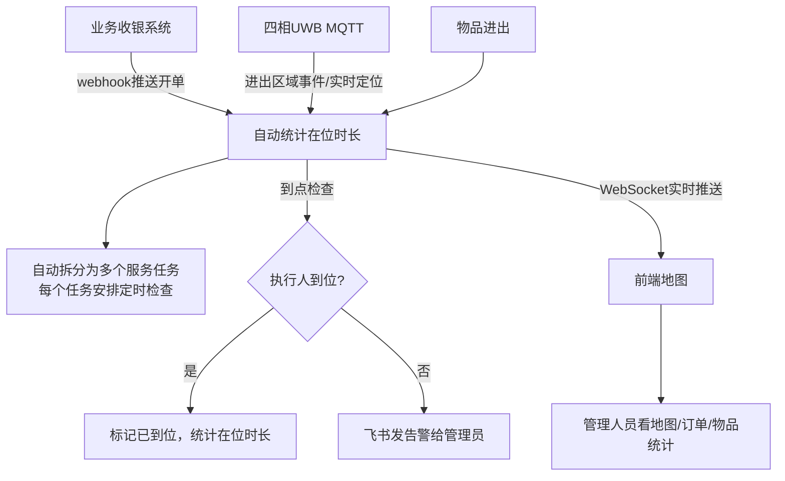

# UWB 定位 + 服务流程监控系统

基于四相科技恒迹云UWB系统接口，自建**服务流程自动化监控系统**。

支持多门店、多服务任务、人员/物品双层监控。

## 项目功能

### 核心能力

| 层面         | 功能                                                   | 完成情况 |
| ---------- | ---------------------------------------------------- | ---- |
| **人员服务监控** | 一个开单 = 多个服务任务（上毛巾/清台/呼叫服务/演绎/结账），每个任务超时检查是否到位，超时飞书告警 | ✅ 完成 |
| **物品轨迹统计** | 清洁车/蛋糕车等物品自动记录进出区域时间，统计今日在位时长                        | ✅ 完成 |
| **实时地图展示** | OpenLayers展示所有人员/物品位置，支持多楼层/多门店切换                    | ✅ 完成 |

## 目录结构

```
uwb-monitoring/
├── backend.py       # Python MQTT订阅 + WebSocket推送后端 + 服务监控逻辑
├── index.html       # OpenLayers 前端地图展示 + 订单/物品监控面板
├── README.md        # 本文档
├── architecture.md  # 整体架构说明
```

## 业务流程



## 快速开始

### 1. 修改配置

编辑 `backend.py`，修改以下配置：

```python
# ========== MQTT配置（四相给你） ==========
MQTT_HOST = "your-mqtt-host"      # MQTT服务器地址
MQTT_PORT = 1883
MQTT_USERNAME = "username"        # MQTT用户名
MQTT_PASSWORD = "password"        # MQTT密码
TENANT_ID = 1                    # 你的租户ID

# ========== 服务监控配置 ==========
WS_PORT = 8765                   # WebSocket端口
# 开单后默认多久检查是否到位（单位：分钟）
CHECK_DELAY_MINUTES = 30
# 通知配置
NOTIFICATION = {
    "enable": True,
    "feishu_webhook": "https://open.feishu.cn/open-apis/bot/v2/hook/your-key",  # 飞书机器人webhook
    "sms_enable": False,  # 是否启用短信（留待扩展）
}
# 业务系统API配置
BUSINESS_API = {
    "base_url": "https://your-business-system/api",  # 业务系统API地址
    "api_key": "",  # API密钥
    "enable_polling": False,  # 是否轮询拉取，False = webhook接收
}
```

编辑 `index.html`，修改以下配置：

```javascript
const UWB_BOUNDS = {
  // 修改为你的UWB系统实际物理范围 (单位: 米)
  minX: 0, maxX: 150,
  minY: 0, maxY: 100,
};

// 楼层/门店配置（多个门店就是多个楼层配置）
const FLOORS = [
  {
    id: 1,
    name: '1楼',
    imageUrl: './floor-1.png',  // 你的楼层平面图URL
    imageWidth: 1500,
    imageHeight: 1000,
  },
];
```

### 2. 安装依赖

```bash
pip install paho-mqtt websockets requests
```

### 3. 运行后端

```bash
python backend.py
```

### 4. 打开前端

直接用浏览器打开 `index.html`，或者用nginx/apache托管。

## 数据结构说明

### 服务订单 (ServiceOrder)

- 一个客人开单 = 一个订单
- 一个订单包含**多个服务任务**（上热毛巾、定时清台等）
- 每个任务独立检查超时、统计在位时长

### 服务任务 (ServiceTask)

| 字段                   | 说明                      |
| -------------------- | ----------------------- |
| task_id              | 任务唯一ID                  |
| task_name            | 任务名称（"上热毛巾"、"定时清台"）     |
| assigned_card_id     | 执行人UWB标签ID              |
| assigned_name        | 执行人姓名                   |
| area_id              | 目标区域ID                  |
| area_name            | 目标区域名称                  |
| check_delay_minutes  | 触发检查延迟                  |
| scheduled_check_time | 计划检查时间戳                 |
| status               | pending/arrived/timeout |
| arrived_time         | 到位时间                    |
| leave_time           | 离开时间                    |
| duration_minutes     | 在位时长（分钟）                |

### 物品统计 (ItemStayStat)

- 每个物品（清洁车/蛋糕车）独立统计
- 自动记录进出时间，累计今日在位总时长
- 不需要告警，只记录

## 功能特性

### 后端

- ✅ MQTT自动订阅所有核心topic（实时定位、进入离开、告警）
- ✅ 支持一个订单多个服务任务，各自独立计时检查
- ✅ 人/物分开统计：人员要告警，物品只记录
- ✅ WebSocket实时广播给前端
- ✅ 维护所有点位当前位置缓存
- ✅ 告警状态自动关联到点位
- ✅ 新连接接入自动推送全量当前点位
- ✅ 超时自动飞书告警

### 前端

- ✅ OpenLayers 矢量展示，无限缩放清晰
- ✅ 不同类型点位不同颜色（人员蓝色、物品棕色...）
- ✅ 楼层/门店切换
- ✅ 侧边栏显示活跃订单和任务状态
- ✅ 侧边栏显示物品今日在位统计
- ✅ 实时告警列表展示
- ✅ 顶部统计（待检查任务数/超时任务数/在线人员/当前告警）
- ✅ 点击点位弹出详情信息
- ✅ 告警点位红色高亮
- ✅ 任务按状态着色（黄待检/绿到位/红超时）
- ✅ 自动重连WebSocket

## 坐标对应关系

OpenLayers直接使用UWB的原始物理坐标（米），底图图片会自动拉伸适配到你定义的 `UWB_BOUNDS` 范围。

所以：

1. 导出CAD图纸为PNG时，保持比例和实际物理比例一致
2. 在FLOORS配置中填写图片像素尺寸
3. OpenLayers会自动缩放匹配，坐标完全对齐

## 多门店部署

如果多个门店，推荐：

- 每个门店对应一个 `building` 或者 `floor`
- 前端切换门店查看
- 所有数据汇总到同一个后台，管理员一个网页看全部门店

部署选项：

1. **测试阶段**：本地运行 + ngrok内网穿透 → 满足测试需求
2. **上线运行**：购买云服务器（1核2G足够），部署在公网，所有门店都能用

## 下一步开发（可选扩展）

1. **对接业务系统API**：完善webhook接收，自动创建订单任务
2. **数据持久化**：添加SQLite存储历史订单、任务、物品轨迹
3. **轨迹回放**：按时间查询历史位置，前端动画回放
4. **短信通知**：需要的话可以对接阿里云短信增加短信通知

## 部署

推荐用 supervisor 托管后端进程：

```ini
[program:uwb-backend]
command=python3 /path/to/uwb-monitoring/backend.py
directory=/path/to/uwb-monitoring
user=your-user
autostart=true
autorestart=true
stdout_logfile=/var/log/uwb-backend.log
redirect_stderr=true
```

前端放到 nginx 静态目录即可。

## 技术栈

| 层级  | 技术                                         |
| --- | ------------------------------------------ |
| 后端  | Python + paho-mqtt + websockets + requests |
| 前端  | OpenLayers 6.x                             |
| 协议  | MQTT (订阅恒迹云) + WebSocket (推前端)             |

## 代码量

- 后端: ~500行
- 前端: ~600行

框架和业务逻辑都已经开发完成，填写配置就能运行。
