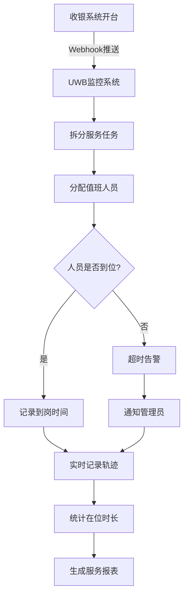

# UWB定位监控系统 - 需求分析与项目文档

> 项目代号：恒迹云UWB MQTT对接 + WebSocket推送后端 + 服务人员到岗监控  
> 创建日期：2026-04-29  
> 最后更新：2026-04-29

---

## 📋 目录

1. [项目概述](#1-项目概述)
2. [业务流程](#2-业务流程)
3. [系统架构](#3-系统架构)
4. [功能模块](#4-功能模块)
5. [技术栈](#5-技术栈)
6. [系统对接](#6-系统对接)
7. [数据采集](#7-数据采集)
8. [管理分析](#8-管理分析)
9. [当前进度](#9-当前进度)
10. [后续规划](#10-后续规划)

---

## 1. 项目概述

### 1.1 项目背景

本项目基于**四相科技恒迹云UWB系统**接口，自建**服务流程自动化监控系统**，用于店面包房服务管理。通过对接收银系统和UWB定位系统，实现服务人员的到岗监控、轨迹记录和服务质量分析。

### 1.2 核心目标

- **系统对接**：实现收银系统与UWB系统的无缝连接
- **数据采集**：实时采集人员位置、服务状态、在位时长等数据
- **管理分析**：提供实时监控、到岗率统计、服务分析等管理功能

### 1.3 应用场景

适用于按摩店、SPA会所、KTV、餐饮等需要服务人员到店包房服务的场景。

---

## 2. 业务流程

### 2.1 标准服务流程

```
开台开单 → 值班人员接单 → 开始服务 → UWB记录轨迹 → 服务完成
```

### 2.2 详细流程说明

1. **收银系统开台**
   - 客人在前台选择包房类型（如VIP包厢、普通包房等）
   - 收银系统生成订单，包含：订单号、客人信息、包房号、开台时间
   - 收银系统通过Webhook/API推送开台信息到UWB监控系统

2. **任务拆分与分配**
   - UWB监控系统接收开台信息
   - 自动拆分为多个服务任务（如：上热毛巾、清理台面等）
   - 每个任务设定检查时间和执行人

3. **人员服务执行**
   - 值班人员UWB标签接收任务通知
   - 人员前往指定包房开始服务
   - UWB系统实时记录人员位置和轨迹

4. **到岗监控与超时告警**
   - 系统在设定时间检查人员是否到位
   - 已到位：记录到岗时间、在位时长
   - 未到位：超时告警，通知管理员

5. **服务完成与数据统计**
   - 服务完成后记录离开时间
   - 自动统计：响应时间、服务时长、在岗时长等
   - 生成报表供管理分析

### 2.3 业务流程图



---

## 3. 系统架构

### 3.1 整体架构

```
┌─────────────────┐         ┌─────────────────┐
│   收银系统      │         │   四相UWB系统    │
│ (fun360/其他)   │         │  (MQTT Server)   │
└────────┬────────┘         └────────┬────────┘
         │                           │
         │ Webhook推送               │ MQTT订阅
         │                           │
         ▼                           ▼
┌─────────────────────────────────────────────────┐
│          UWB监控系统 (Python后端)                │
│  ┌────────────┐  ┌──────────┐  ┌──────────────┐ │
│  │ 订单管理    │  │ MQTT客户端│  │ 任务调度引擎  │ │
│  └────────────┘  └──────────┘  └──────────────┘ │
│  ┌────────────┐  ┌──────────┐  ┌──────────────┐ │
│  │ 位置服务    │  │ WebSocket│  │ 数据持久化    │ │
│  └────────────┘  └──────────┘  └──────────────┘ │
└────────────────────────┬────────────────────────┘
                         │ WebSocket推送
                         ▼
┌─────────────────────────────────────────────────┐
│           前端监控页面 (HTML/JS)                 │
│  ┌────────────┐  ┌──────────┐  ┌──────────────┐ │
│  │ 实时地图    │  │ 订单监控  │  │ 数据统计     │ │
│  └────────────┘  └──────────┘  └──────────────┘ │
└─────────────────────────────────────────────────┘
```

### 3.2 技术架构图

```
客户端层
  ├── 前端监控页面 (HTML5 + JavaScript)
  ├── 测试工具页面 (HTML5 + JavaScript)
  └── 移动端 (未来扩展)

应用层
  ├── Flask Web框架 (HTTP服务)
  ├── WebSocket服务器 (实时推送)
  ├── MQTT客户端 (UWB数据订阅)
  └── 任务调度引擎 (定时检查)

数据层
  ├── SQLite数据库 (当前)
  └── MySQL数据库 (未来扩展)

外部系统
  ├── 收银系统 (Webhook对接)
  ├── 四相UWB系统 (MQTT对接)
  └── 通知系统 (飞书/短信)
```

---

## 4. 功能模块

### 4.1 系统对接模块

#### 4.1.1 收银系统对接

**支持的系统：**
- ✅ fun360业务系统
- 🔲 天财商龙（待开发）
- 🔲 哗啦啦（待开发）
- 🔲 其他系统（可定制）

**对接方式：**
- Webhook推送（实时）
- API轮询（备用）

**已实现接口：**
| 接口 | 方法 | 功能 | 状态 |
|------|------|------|------|
| `/webhook` | POST | 接收收银系统推送 | ✅ |
| `/test_order` | POST | 创建测试订单 | ✅ |

#### 4.1.2 UWB系统对接

**MQTT订阅Topic：**
| Topic | 功能 | 说明 |
|-------|------|------|
| `/{tenant_id}/pos_business/card_now_info/#` | 实时定位 | 获取所有标签当前位置 |
| `/{tenant_id}/pos_business/inarea` | 进入区域 | 标签进入指定区域事件 |
| `/{tenant_id}/pos_business/outarea` | 离开区域 | 标签离开指定区域事件 |
| `/{tenant_id}/alarm/start/#` | 告警开始 | 标签触发告警 |
| `/{tenant_id}/alarm/stop/#` | 告警结束 | 告警解除 |

### 4.2 数据采集模块

#### 4.2.1 位置数据采集

- ✅ 实时获取人员/物品位置坐标
- ✅ 楼层信息识别
- ✅ 建筑信息识别
- ✅ 区域信息识别
- ✅ 告警状态监控

#### 4.2.2 服务数据采集

**人员轨迹记录：**
- ✅ 进入区域时间
- ✅ 离开区域时间
- ✅ 在位时长统计
- ✅ 离开区域次数

**服务任务记录：**
- ✅ 任务创建时间
- ✅ 计划检查时间
- ✅ 实际到岗时间
- ✅ 超时标记
- ✅ 任务状态（pending/arrived/timeout）

#### 4.2.3 物品轨迹记录

- ✅ 物品进入区域时间
- ✅ 物品离开区域时间
- ✅ 物品在位时长
- ✅ 今日累计在位时长

### 4.3 实时监控模块

#### 4.3.1 地图监控

**功能特性：**
- ✅ 实时显示所有人员/物品位置
- ✅ 不同类型标签不同颜色标识
  - 人员：蓝色
  - 物品：棕色
  - 告警：红色脉冲动画
- ✅ 鼠标悬停显示详情
- ✅ 楼层切换（支持多楼层）
- ✅ 自适应缩放

#### 4.3.2 订单监控

**功能特性：**
- ✅ 实时显示活跃订单
- ✅ 订单任务状态展示
  - ⏳ 待检查（黄色）
  - ✅ 已到位（绿色）
  - ❌ 超时未到位（红色）
- ✅ 开单时间显示
- ✅ 任务执行人显示
- ✅ 在位时长统计

#### 4.3.3 告警监控

**功能特性：**
- ✅ 实时告警列表
- ✅ 告警级别区分
- ✅ 告警时间显示
- ✅ 告警信息详情

#### 4.3.4 物品统计

**功能特性：**
- ✅ 今日物品在位统计
- ✅ 当前位置显示
- ✅ 累计在位时长

### 4.4 通知告警模块

#### 4.4.1 告警触发条件

- 服务任务超时未到位
- 人员进入/离开敏感区域
- 自定义告警规则

#### 4.4.2 管理员通知方式

- ✅ 飞书Webhook通知
- 🔲 短信通知（待开发）
- 🔲 邮件通知（待开发）

### 4.5 值班人员任务通知方案

> **说明**：UWB标签本身只是定位设备，不具备消息推送功能。需要通过其他方式通知值班人员。

#### 4.5.1 方案对比

| 方案 | 成本 | 实施难度 | 适用场景 | 推荐度 |
|------|------|---------|---------|--------|
| 飞书/钉钉通知 | 低 | 简单 | 已使用企业通讯工具 | ⭐⭐⭐⭐⭐ |
| 微信小程序 | 中 | 中等 | 需要完整交互 | ⭐⭐⭐⭐ |
| 短信通知 | 中 | 简单 | 紧急通知备用 | ⭐⭐⭐ |
| 语音电话 | 高 | 中等 | 多次超时未响应 | ⭐⭐ |
| 前台广播 | 低 | 简单 | 传统门店 | ⭐⭐ |
| 智能手表 | 高 | 复杂 | 高端场所 | ⭐⭐ |

#### 4.5.2 推荐方案：飞书/钉钉群机器人通知（短期）

**优点：**
- ✅ 实施成本低，无需额外硬件
- ✅ 支持@指定人员
- ✅ 可记录已读/未读状态
- ✅ 支持移动端推送
- ✅ 立即可用

**实现方式：**
```
收银系统开台 → UWB监控系统 → 飞书群机器人 → 值班人员收到通知
```

**通知消息示例：**
```
📋 新服务任务通知

🏠 包房：888号VIP包厢
👤 客人：张三
⏰ 开台时间：2026-04-29 15:30
🔧 任务：上热毛巾+开机套
👷 执行人：李四（标签ID: 1001）
⏱️ 请在30分钟内到岗！
```

**技术实现：**
- 飞书Webhook机器人API
- 钉钉自定义机器人
- 企业微信应用消息

**代码示例：**
```python
def notify_staff_task(staff_info, task_info):
    """通知值班人员新任务"""
    content = {
        "msg_type": "interactive",
        "card": {
            "header": {
                "title": "📋 新服务任务通知",
                "template": "blue"
            },
            "elements": [
                {"tag": "div", "text": f"**包房**：{task_info.room_name}"},
                {"tag": "div", "text": f"**客人**：{task_info.customer_name}"},
                {"tag": "div", "text": f"**开台时间**：{task_info.create_time}"},
                {"tag": "div", "text": f"**任务**：{task_info.task_name}"},
                {"tag": "div", "text": f**请在{task_info.check_delay_minutes}分钟内到岗！"},
            ]
        }
    }
    requests.post(NOTIFICATION["feishu_webhook"], json=content)
```

#### 4.5.3 升级方案：微信小程序值班端（中期）

**功能设计：**
- 实时接收任务通知
- 查看今日任务列表
- 一键确认接单
- 标记服务完成
- 查看历史任务
- 查看个人绩效数据

**技术选型：**
- 微信小程序（推荐，开发成本低）
- 企业微信H5
- 钉钉H5

**业务流程：**
```
1. 值班人员扫码登录（绑定UWB标签ID）
2. 接收新任务推送
3. 查看任务详情
4. 确认接单
5. 前往包房服务
6. UWB自动记录到岗
7. 服务完成后标记完成
```

#### 4.5.4 备用方案：短信通知

**使用场景：**
- 超时未到位告警
- 紧急呼叫
- 网络异常时备用

**优点：**
- ✅ 无需安装App
- ✅ 到达率高
- ✅ 适合紧急情况

**缺点：**
- ❌ 成本较高（按条收费）
- ❌ 信息量有限

#### 4.5.5 通知策略配置

**可配置项：**
```python
NOTIFICATION_STRATEGY = {
    # 新任务通知
    "new_task": {
        "methods": ["feishu", "wechat_mini"],  # 飞书+小程序
        "immediate": True,
    },
    # 超时告警
    "timeout_alert": {
        "methods": ["feishu", "sms"],  # 飞书+短信
        "immediate": True,
        "retry_count": 3,
        "retry_interval": 300,  # 5分钟重试
    },
    # 服务完成通知
    "task_complete": {
        "methods": ["feishu"],
        "immediate": False,
        "batch_interval": 3600,  # 每小时批量推送
    }
}
```

### 4.6 数据统计模块（待开发）

#### 4.6.1 到岗率统计

**统计维度：**
- 按人员统计
- 按日期统计
- 按包房类型统计

**指标：**
- 总任务数
- 按时到岗数
- 超时未到位数
- 到岗率（按时到岗/总任务数）

#### 4.6.2 服务响应时间分析

**指标：**
- 平均响应时间
- 最短响应时间
- 最长响应时间
- 响应时间分布

#### 4.6.3 在位时长分析

**统计维度：**
- 按人员统计
- 按包房统计
- 按日期统计

**指标：**
- 平均在位时长
- 总在位时长
- 在位时长趋势

#### 4.6.4 包房使用率分析

**统计维度：**
- 按包房统计
- 按日期统计
- 按时段统计

**指标：**
- 开台次数
- 使用时长
- 空闲时长
- 使用率

---

## 5. 技术栈

### 5.1 后端技术

| 技术 | 版本 | 用途 |
|------|------|------|
| Python | 3.9+ | 开发语言 |
| Flask | 2.3+ | Web框架 |
| websockets | 12.0+ | WebSocket服务器 |
| paho-mqtt | 2.0+ | MQTT客户端 |
| SQLAlchemy | 2.0+ | ORM框架 |
| SQLite | 内置 | 数据库（开发环境） |

### 5.2 前端技术

| 技术 | 版本 | 用途 |
|------|------|------|
| HTML5 | - | 页面结构 |
| CSS3 | - | 样式设计 |
| JavaScript | ES6+ | 交互逻辑 |
| WebSocket API | - | 实时通信 |

### 5.3 通信协议

| 协议 | 端口 | 用途 |
|------|------|------|
| HTTP | 8888 | Web API服务 |
| WebSocket | 8887 | 实时数据推送 |
| MQTT | 1883 | UWB数据订阅 |

---

## 6. 系统对接

### 6.1 收银系统对接规范

#### 6.1.1 Webhook接口

**请求地址：**
```
POST http://your-server:8888/webhook
```

**请求头：**
```
Content-Type: application/json
```

**请求参数：**
```json
{
  "order_sn": "订单号",
  "shop_id": 门店ID,
  "shop_name": "门店名称",
  "room_id": 包房ID,
  "room_name": "包房名称",
  "created_at": "开单时间",
  "member_mobile": "客人手机号",
  "customer_name": "客人姓名"
}
```

**响应格式：**
```json
{
  "error_code": 0,
  "message": "success"
}
```

#### 6.1.2 签名验证

部分收银系统需要签名验证：
```
参数排序：nonce, secret, timestamp
签名算法：MD5排序后的参数
```

### 6.2 UWB系统对接规范

#### 6.2.1 MQTT连接参数

| 参数 | 说明 | 必填 |
|------|------|------|
| MQTT_HOST | MQTT服务器地址 | 是 |
| MQTT_PORT | MQTT端口（默认1883） | 是 |
| MQTT_USERNAME | MQTT用户名 | 是 |
| MQTT_PASSWORD | MQTT密码 | 是 |
| TENANT_ID | 租户ID | 是 |

#### 6.2.2 数据类型说明

**utype（标签类型）：**
| 值 | 类型 | 说明 |
|----|------|------|
| 1 | 人员 | 员工/技师 |
| 2 | 车辆 | - |
| 3 | 访客 | - |
| 5 | 物品 | 清洁车/蛋糕车等 |

**任务状态：**
| 状态 | 说明 |
|------|------|
| pending | 待检查 |
| arrived | 已到位 |
| timeout | 超时未到位 |

---

## 7. 数据采集

### 7.1 位置数据采集

**采集频率：** 实时（由UWB系统推送频率决定）

**采集字段：**
- card_id：标签ID
- name：标签名称
- x, y, z：坐标
- floor_id, floor_name：楼层信息
- building_id, building_name：建筑信息
- scene_id, scene_name：场景信息
- utype：标签类型
- is_alarm：是否告警
- timestamp：时间戳

### 7.2 服务数据采集

**触发时机：**
- 收银系统开台
- 人员进入区域
- 人员离开区域
- 定时检查任务

**采集字段：**
- order_id：订单ID
- task_id：任务ID
- task_name：任务名称
- assigned_card_id：执行人ID
- assigned_name：执行人姓名
- area_id, area_name：区域信息
- scheduled_check_time：计划检查时间
- checked_time：实际检查时间
- arrived_time：到岗时间
- leave_time：离开时间
- duration_minutes：在位时长
- status：任务状态

### 7.3 物品轨迹采集

**触发时机：**
- 物品进入区域
- 物品离开区域

**采集字段：**
- item_id：物品ID
- item_name：物品名称
- area_id, area_name：区域信息
- enter_time：进入时间
- leave_time：离开时间
- duration_minutes：本次时长
- total_duration_today：今日累计时长

---

## 8. 管理分析

### 8.1 实时监控

**监控指标：**
- 在线人员数
- 在线物品数
- 当前告警数
- 待检查任务数
- 超时未到位数

**展示方式：**
- 实时地图展示
- 侧边栏状态面板
- 悬停详情提示

### 8.2 数据分析（待开发）

#### 8.2.1 到岗率报表

**报表维度：**
- 日报：按日期统计
- 人员报表：按人员统计
- 包房报表：按包房类型统计

**展示形式：**
- 表格数据
- 柱状图
- 折线图

#### 8.2.2 服务响应时间报表

**统计指标：**
- 平均响应时间
- 响应时间分布
- 响应时间趋势

#### 8.2.3 在位时长报表

**统计维度：**
- 人员维度
- 包房维度
- 时间维度

#### 8.2.4 异常事件报表

**异常类型：**
- 超时未到位
- 提前离岗
- 异常停留

### 8.3 导出功能（待开发）

- Excel导出
- PDF报表
- CSV数据

---

## 9. 当前进度

### 9.1 已完成功能

| 模块 | 功能 | 状态 |
|------|------|------|
| 系统对接 | fun360 webhook对接 | ✅ 完成 |
| 系统对接 | UWB MQTT订阅 | ✅ 完成 |
| 数据采集 | 实时位置采集 | ✅ 完成 |
| 数据采集 | 人员轨迹记录 | ✅ 完成 |
| 数据采集 | 物品轨迹记录 | ✅ 完成 |
| 实时监控 | 地图展示 | ✅ 完成 |
| 实时监控 | 订单监控 | ✅ 完成 |
| 实时监控 | 告警监控 | ✅ 完成 |
| 实时监控 | 物品统计 | ✅ 完成 |
| 通知告警 | 飞书通知 | ✅ 完成 |
| 数据存储 | SQLite持久化 | ✅ 完成 |
| 测试工具 | 测试页面 | ✅ 完成 |

### 9.2 待开发功能

| 模块 | 功能 | 优先级 |
|------|------|--------|
| 数据分析 | 到岗率统计 | P0 |
| 数据分析 | 服务响应时间分析 | P0 |
| 数据分析 | 在位时长报表 | P1 |
| 数据分析 | 包房使用率分析 | P1 |
| 数据分析 | 历史数据查询 | P1 |
| 数据导出 | Excel导出 | P1 |
| 系统对接 | 更多收银系统支持 | P2 |
| 通知告警 | 短信通知 | P2 |
| 管理优化 | 值班排班管理 | P2 |
| 管理优化 | 绩效评分 | P3 |

---

## 10. 后续规划

### 10.1 第一阶段（核心功能）

- [ ] 到岗率统计报表
- [ ] 服务响应时间分析
- [ ] 数据可视化图表
- [ ] 按日期/人员/包房查询

### 10.2 第二阶段（数据分析）

- [ ] 历史数据查询
- [ ] 异常事件记录
- [ ] Excel报表导出
- [ ] 数据趋势分析

### 10.3 第三阶段（管理优化）

- [ ] 值班排班管理
- [ ] 服务标准配置
- [ ] 绩效评分系统
- [ ] 多收银系统支持

### 10.4 第四阶段（系统增强）

- [ ] 移动端App
- [ ] 短信通知
- [ ] 邮件通知
- [ ] 数据大屏展示

---

## 附录

### A. 数据库表结构

#### 服务人员表 (staff)
- id: 主键
- card_id: UWB标签ID
- name: 姓名
- merchant_id: 门店ID
- phone: 手机号

#### 服务订单表 (service_orders)
- id: 主键
- order_id: 订单号
- customer_name: 客户姓名
- room_number: 包房号
- service_area_id: 服务区域ID
- service_area_name: 服务区域名称
- create_time: 开单时间戳
- status: 订单状态

#### 服务任务表 (service_tasks)
- id: 主键
- order_id: 订单ID（外键）
- task_id: 任务ID
- task_name: 任务名称
- assigned_card_id: 执行人标签ID
- assigned_name: 执行人姓名
- area_id: 区域ID
- area_name: 区域名称
- check_delay_minutes: 检查延迟（分钟）
- scheduled_check_time: 计划检查时间戳
- status: 任务状态
- checked_time: 实际检查时间戳
- arrived_time: 到岗时间戳
- leave_time: 离开时间戳
- duration_minutes: 在位时长（分钟）

#### 物品停留记录表 (item_stay_records)
- id: 主键
- item_id: 物品ID
- item_name: 物品名称
- area_id: 区域ID
- area_name: 区域名称
- enter_time: 进入时间戳
- leave_time: 离开时间戳
- duration_minutes: 停留时长（分钟）

### B. API接口列表

| 接口 | 方法 | 功能 |
|------|------|------|
| `/` | GET | 监控首页 |
| `/test` | GET | 测试工具页面 |
| `/webhook` | POST | 接收收银系统推送 |
| `/test_order` | POST | 创建测试订单 |
| `/test_location` | POST | 添加测试人员定位 |
| `/test_item_location` | POST | 添加测试物品定位 |
| `/test_enter_area` | POST | 触发进入区域事件 |
| `/test_leave_area` | POST | 触发离开区域事件 |
| `/health` | GET | 健康检查 |
| `/api/orders` | GET | 获取订单列表 |
| `/api/locations` | GET | 获取位置列表 |

### C. 配置文件说明

复制 `config_template.py` 为 `config.py` 并填写真实配置：

```python
# MQTT配置
MQTT_HOST = "your-mqtt-host"
MQTT_PORT = 1883
MQTT_USERNAME = "username"
MQTT_PASSWORD = "password"
TENANT_ID = 1

# WebSocket配置
WS_PORT = 8887

# 通知配置
NOTIFICATION = {
    "enable": True,
    "feishu_webhook": "https://open.feishu.cn/open-apis/bot/v2/hook/your-key",
}

# 业务系统API配置
BUSINESS_API = {
    "base_url": "https://open-api.fun360.cn",
    "app_id": "YYP",
    "app_secret": "your-secret",
    "enable_polling": False,
}

# 数据库配置
DATABASE_URL = "sqlite:///./uwb_monitoring.db"

# Flask服务配置
FLASK_HOST = "0.0.0.0"
FLASK_PORT = 8888
```

---

## 更新日志

### 2026-04-29
- ✅ 完成项目初始化
- ✅ 完成MQTT对接
- ✅ 完成WebSocket推送
- ✅ 完成前端监控页面
- ✅ 完成测试工具页面
- ✅ 完成文档编写

---

**文档版本：** v1.0  
**维护人：** 项目开发团队  
**最后更新：** 2026-04-29
